# Practica 2048

Esta practica se divide en dos partes, por un lado la configuracion de una imagen docker haciendo un dockerfile y crearemos acciones en github para que suba automaticamente la imagen a dockerhub

En el archiivo dockerfile que creamos tiene que cumplir con los requisitos de: usar la imagen de ubuntu haciendo uso de su ultima version, instalaremos nginx y git y clonaremos un repositorio de github en el 
## Dockerfile  
El archivo Dockerfile contiene el siguiente código
```
FROM ubuntu:24.04
RUN apt update && apt install nginx -y
WORKDIR /var/www/html
RUN apt update && apt install git -y
RUN git clone https://github.com/josejuansanchez/2048 && \ 
    mv /var/www/html/2048/* /var/www/html
CMD ["nginx", "-g", "daemon off;"]
```

En el Encontramos
FROM ubuntu:24.04: donde le decimos que la imagen que usaremos es Ubuntu, la version 24.04
RUN apt update && apt install nginx -y: en este comando ejecutamos dos comandos, actualizamos los paquetes de Ubuntu e instalamos nginx
WORKDIR /var/www/html: creamos un directorio de trabajo, nuestro directorio será /var/www/html
RUN apt update && apt install git -y: ejecutamos instrucciones nuevas, le decimos que actualize los paquetes de Ubuntu e instalamos git
RUN git clone https://github.com/josejuansanchez/2048 && \
    mv /var/www/html/2048/* /var/www/html : en esta instruccion clonamos el repositorio de github y lo movemos al directorio de trabajo
CMD ["nginx", "-g", "daemon off;"]: por ultimo ejecutamos un comando de terminal

## Creacion de acciones(no bancarias)
Para ello tendremos que ir a nuestro repositorio de github donde tenemos subido nuestro Dockerfile, nos dirigiremos a donde pone settings    
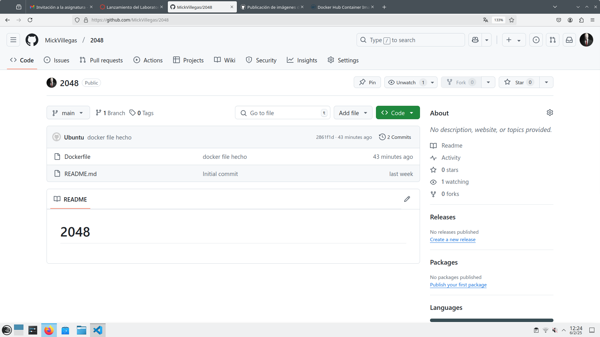
En settings nos fijaremos al panel de la izquierda y buscaremos Security y seleccionaremos secretis and variables donde encontraremos la seccion envioriment secrets, ahí le pulsamos a new reposity secrets, ahi nos pedira poner un nombre de variable y un secreto, estos seran tockens que tenemos que crear en dockerhub  

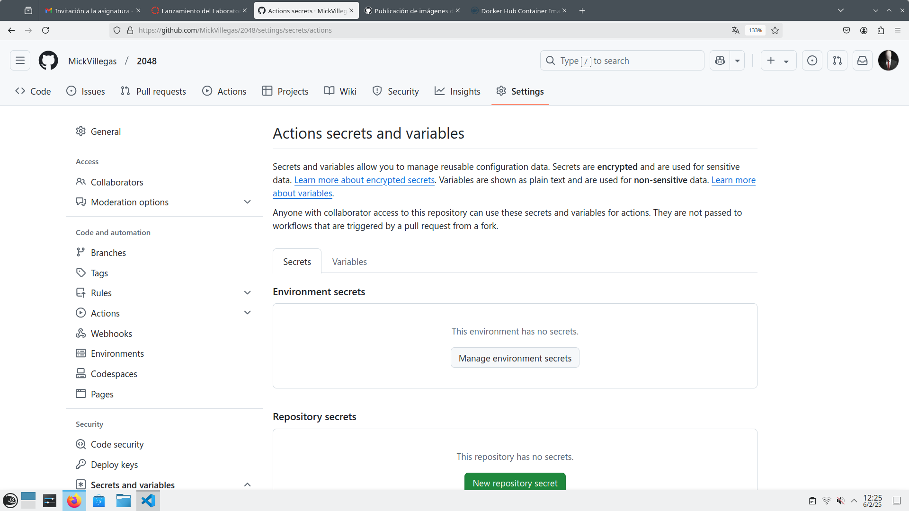

Para crear un tocken en github iremos a la configuracion de nuestro perfil, seleccionamos la opcion personal access tockens y luego le damos al boton azul generate new tocken  

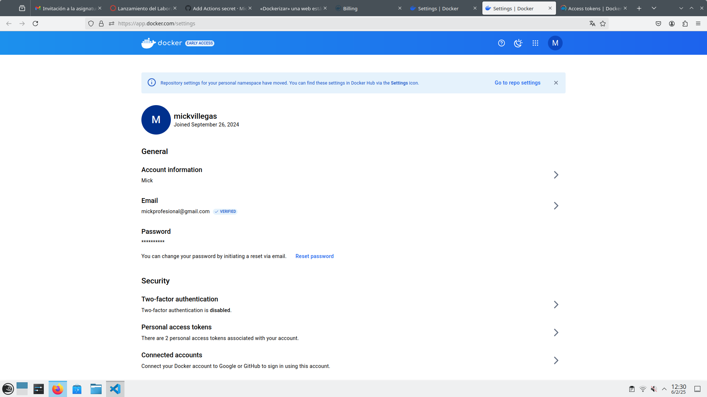
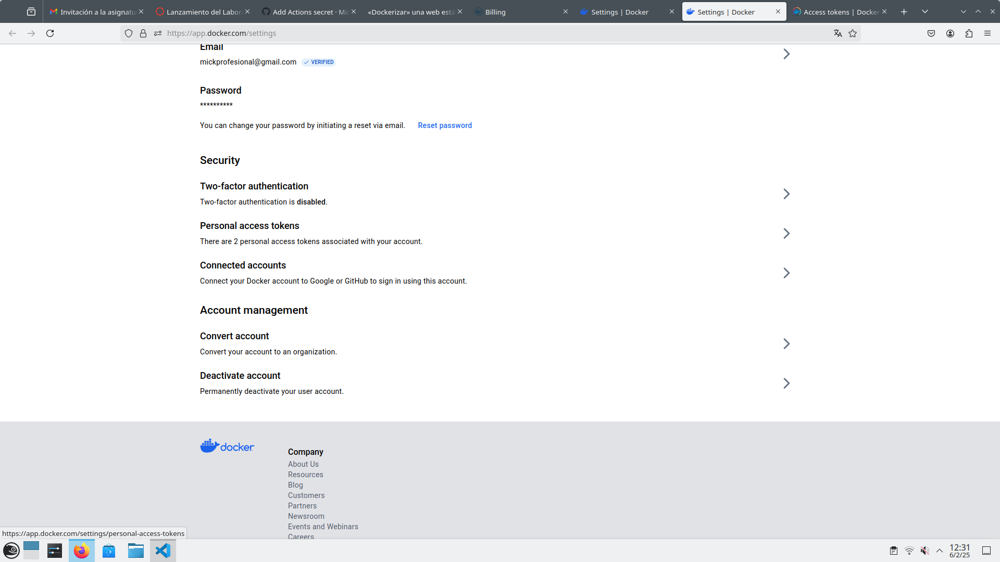
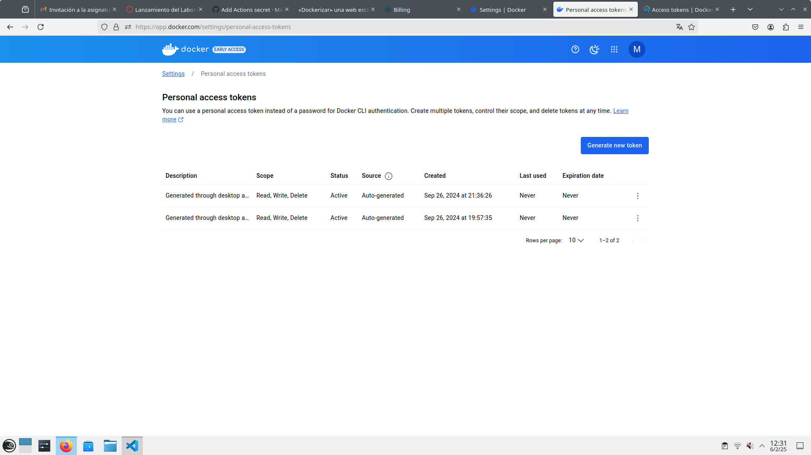  

aqui le daremos una descripcion al tocken, le pondremos que no tiene fecha de caducidad y sobretodo le daremos permisos de lecturta, escritura y eliminacion  

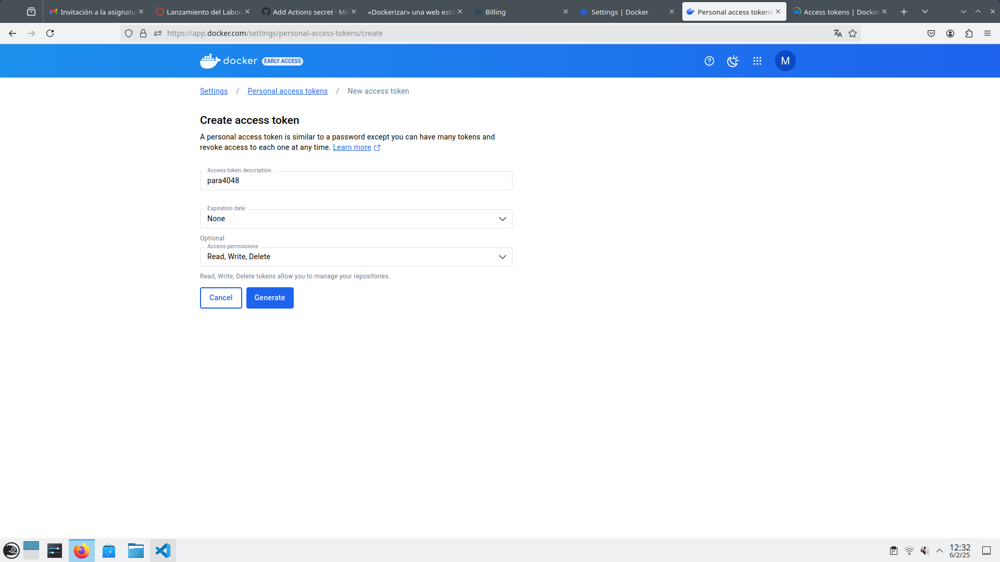  

Entonces nos dará dos comandos, el primero el login de docker con nuestro nombre de usuario donde solo copiaremos el nombre de usuario y una contraseña para acceder al tocken  

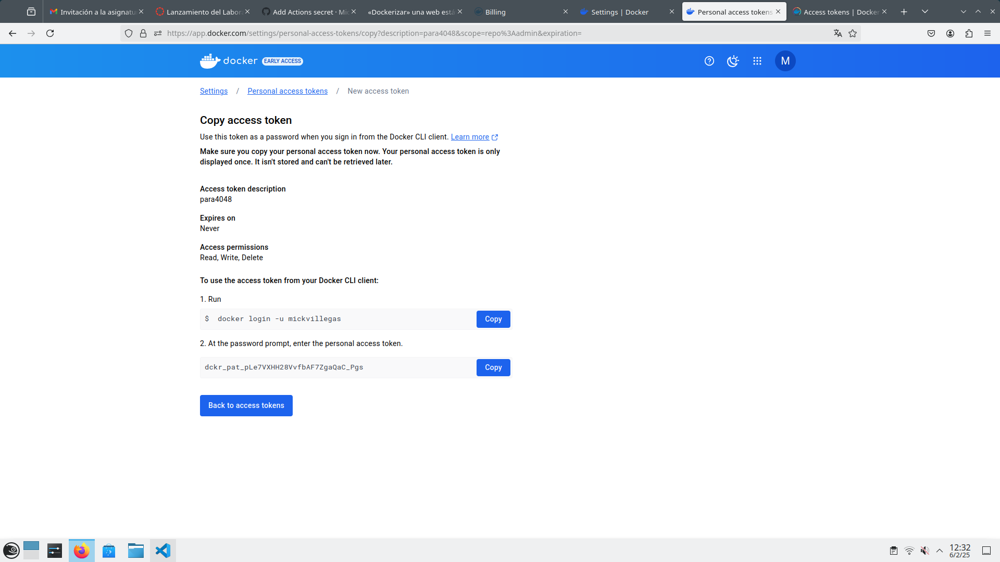  

Entonces en github nos crearemos una variable DOCKERHUB_USERNAME cullo secreto será el nombre de usuario generado en tel tocken de dockerhub y crearemos otro secreto mas que lo llamaremos DOCKERHUB_TOKEN cullo secreto será la clave generada en el token de en dockerhub  

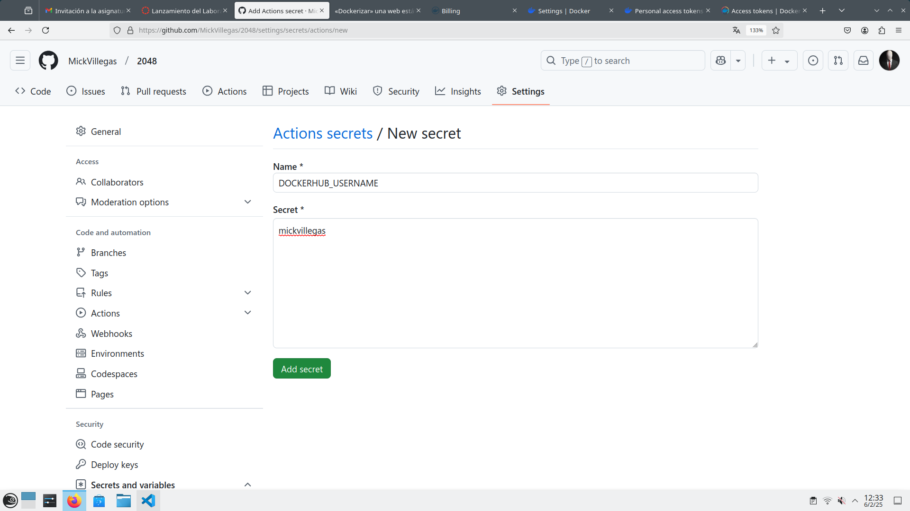
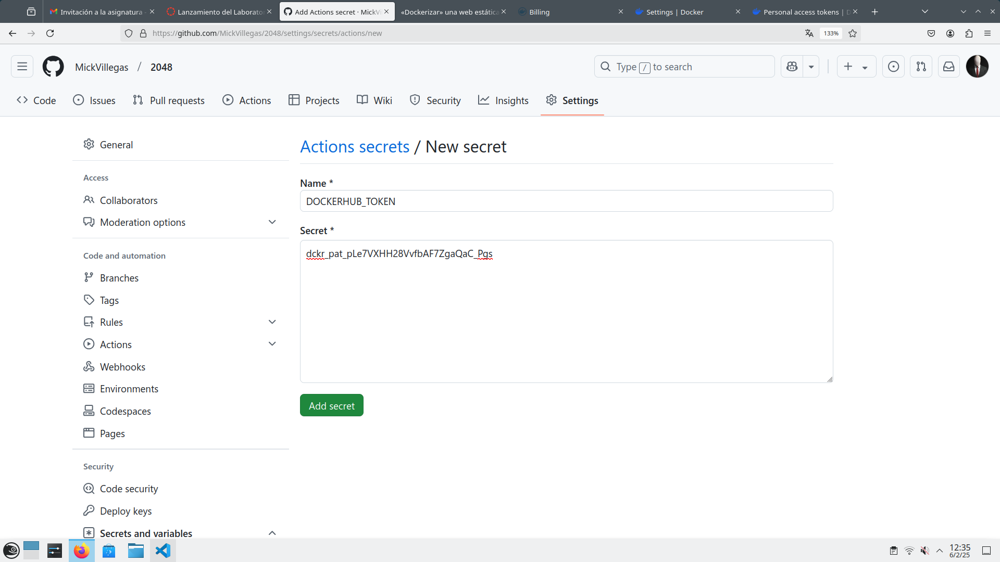  

Ahora nos iremos a actions en nuestro repositorio de github y la damos a new workflow > set up new workflow yourself  

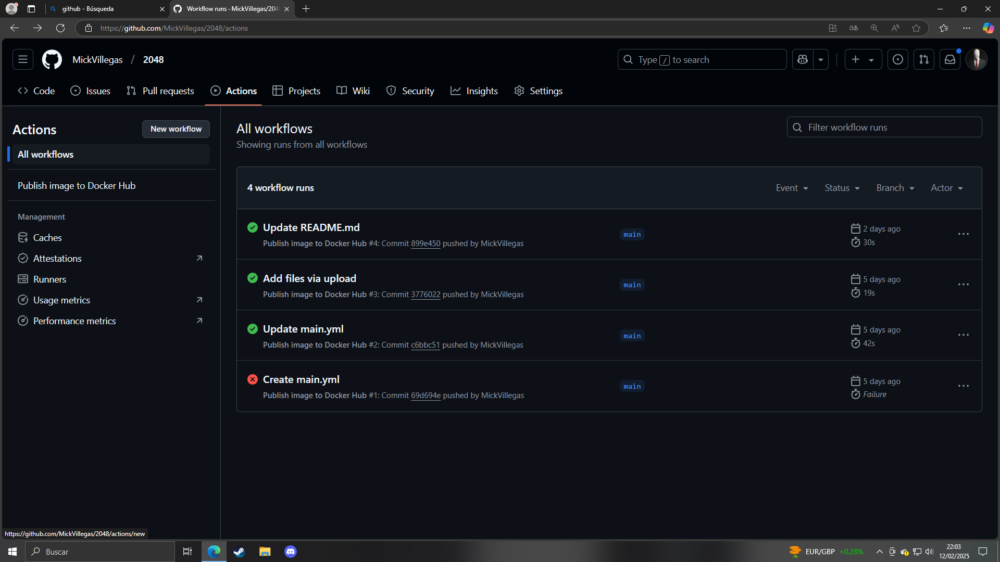
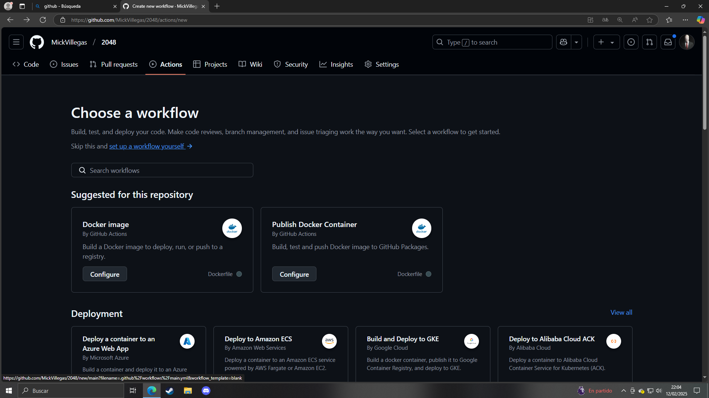  

nos creará un archivo txt, en mi caso llamado main.yml, donde pegaremos y guardaremos el siguiente codigo en el  

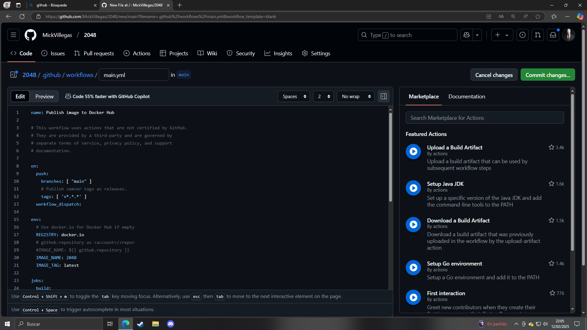  

```
name: Publish image to Docker Hub

# This workflow uses actions that are not certified by GitHub.
# They are provided by a third-party and are governed by
# separate terms of service, privacy policy, and support
# documentation.

on:
  push:
    branches: [ "main" ]
    # Publish semver tags as releases.
    tags: [ 'v*.*.*' ]
  workflow_dispatch:

env:
  # Use docker.io for Docker Hub if empty
  REGISTRY: docker.io
  # github.repository as <account>/<repo>
  #IMAGE_NAME: ${{ github.repository }}
  IMAGE_NAME: 2048
  IMAGE_TAG: latest

jobs:
  build:

    runs-on: ubuntu-latest
    permissions:
      contents: read
      packages: write

    steps:
      - name: Checkout repository
        uses: actions/checkout@v3

      # Set up BuildKit Docker container builder to be able to build
      # multi-platform images and export cache
      # https://github.com/docker/setup-buildx-action
      - name: Set up Docker Buildx
        uses: docker/setup-buildx-action@f95db51fddba0c2d1ec667646a06c2ce06100226 # v3.0.0

      # Login against a Docker registry except on PR
      # https://github.com/docker/login-action
      - name: Log into registry ${{ env.REGISTRY }}
        uses: docker/login-action@343f7c4344506bcbf9b4de18042ae17996df046d # v3.0.0
        with:
          registry: ${{ env.REGISTRY }}
          username: ${{ secrets.DOCKERHUB_USERNAME }}
          password: ${{ secrets.DOCKERHUB_TOKEN }}

      # This action can be used to check the content of the variables
      - name: Debug
        run: |
          echo "github.repository: ${{ github.repository }}"
          echo "env.REGISTRY: ${{ env.REGISTRY }}"
          echo "github.sha: ${{ github.sha }}"
          echo "env.IMAGE_NAME: ${{ env.IMAGE_NAME }}"

      # Build and push Docker image with Buildx (don't push on PR)
      # https://github.com/docker/build-push-action
      - name: Build and push Docker image
        id: build-and-push
        uses: docker/build-push-action@0565240e2d4ab88bba5387d719585280857ece09 # v5.0.0
        with:
          context: .
          push: ${{ github.event_name != 'pull_request' }}
          tags: ${{ env.REGISTRY }}/${{ secrets.DOCKERHUB_USERNAME }}/${{ env.IMAGE_NAME }}:${{ env.IMAGE_TAG }}
          cache-from: type=gha
          cache-to: type=gha,mode=max  
```

Y le damos al boton commit changes, una vez hecho eso nos iremos a actions y podremos publicar la imagen a dockerhub, le damos click en publish image on dockerhub > run workflow > run workflow y nos ejecutará la accion, cuando haya terminado y haya mostrado un  "tic verde" es que todo ha ido bien y se ha hecho la accion, si vamos a nuestra cuenta de dockerhub y miramos nuestras imagenes veremos que se ha publicado la imagen  

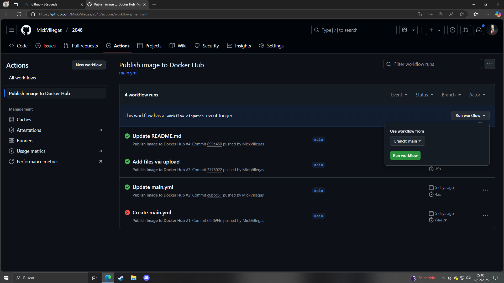  


